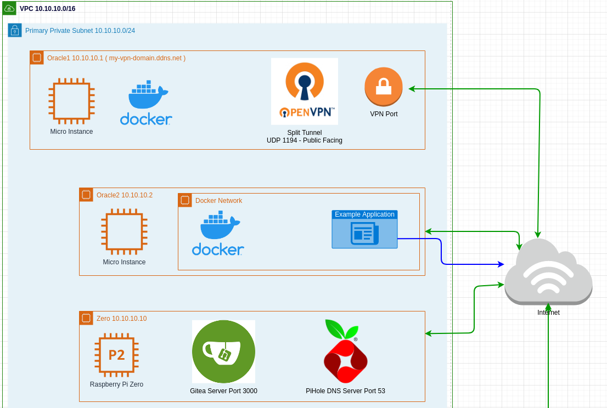

# HomeLab Setup 

## AWS Infrastructure
- AWS Cloudformation template for quick use EC2 instance

## Networking Infrastructure
- OpenVPN in split tunnle mode to create private subnet over internet
- DNS using pihole 

## Source Code Management 
- gitea running on local raspberry pi 

## Others
- gotify instance for notifications

## Future Goals
- [ ] add ELK stack for monitoring and logging 
- [ ] add concourse / jenkins instance ? 
- [ ] add local proxmox / openstack machine to the network for hosting VMs and containers 
- [ ] More things related to AWS and Security
 
 